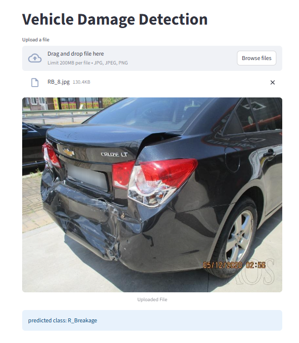

# 🚗 Vehicle Damage Prediction using Deep Learning

## Overview

Vehicle Damage Prediction is a Deep Learning-powered web application that classifies vehicle images into different damage categories. The application uses a fine-tuned ResNet50 model and provides instant predictions through an interactive Streamlit interface.

This project demonstrates the use of Transfer Learning with PyTorch for image classification and deployment using Streamlit.

---


## Features

* Upload vehicle images for damage assessment
* Real-time prediction using a trained ResNet50 model
* User-friendly Streamlit interface
* Deep Learning-based image classification
* Supports six vehicle damage categories

---

## Damage Categories

| Class      | Description    |
| ---------- | -------------- |
| F_Breakage | Front Breakage |
| F_Crushed  | Front Crushed  |
| F_Normal   | Front Normal   |
| R_Breakage | Rear Breakage  |
| R_Crushed  | Rear Crushed   |
| R_Normal   | Rear Normal    |

---

## Model Architecture

### Base Model

* ResNet50 (Pre-trained on ImageNet)

### Transfer Learning Strategy

* Frozen all backbone layers initially
* Unfrozen Layer4 for fine-tuning
* Added custom classification head

### Classification Head

```python
nn.Sequential(
    nn.Dropout(0.5),
    nn.Linear(in_features, 6)
)
```

### Input Specifications

* Image Size: 224 × 224
* Color Channels: RGB
* Normalization:

```python
mean = [0.485, 0.456, 0.406]
std  = [0.229, 0.224, 0.225]
```

---

## Tech Stack

### Programming Language

* Python

### Deep Learning

* PyTorch
* Torchvision

### Deployment

* Streamlit

### Image Processing

* Pillow (PIL)

---

## Project Structure

```text
streamlit-app/
│
├── app.py
├── model_helper.py
├── requirements.txt
├── README.md
│
├── model/
│   └── saved_model.pth
│
└── temp_file.jpg
```

---

## Installation

### Clone the Repository

```bash
git clone https://github.com/Mr.Tanmay18/vehicle-damage-prediction.git
cd vehicle-damage-prediction
```

### Install Dependencies

```bash
pip install -r requirements.txt
```

---

## Run the Application

```bash
streamlit run app.py
```

The application will start on:

```text
http://localhost:8501
```

---

## Requirements

```text
streamlit==1.48.1
torch==2.4.1
torchvision==0.19.1
pillow==11.3.0
numpy==2.1.3
```

---

## How It Works

1. User uploads a vehicle image.
2. Image is resized to 224×224.
3. Image is converted into a tensor and normalized.
4. The trained ResNet50 model performs inference.
5. The predicted damage category is displayed.

---

## Future Improvements

* Damage severity estimation
* Bounding box localization of damaged regions
* Support for multiple vehicle parts
* Confidence score visualization
* Model deployment on cloud platforms
* Mobile-friendly interface

---

## Author

**Tanmay Pakori**

MSc Mathematics and Data Science
Dr. Vishwanath Karad MIT World Peace University (MIT-WPU), Pune

### Skills

* Python
* Deep Learning
* PyTorch
* Machine Learning
* Streamlit
* Data Science

---

## License

This project is intended for educational and portfolio purposes.
